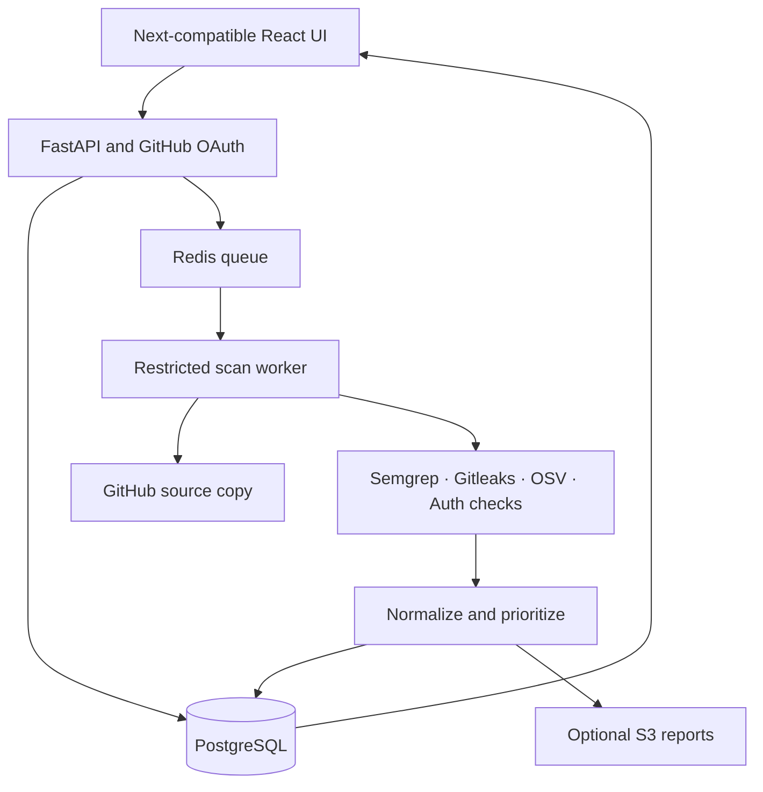

# App Security Doctor

**Understand what needs fixing before you deploy.**

[Preview](https://app-security-doctor.vvreddy1584.chatgpt.site) · [Phase 1 coverage](docs/PHASE1-COVERAGE.md) · [Phase 2 scope](docs/PHASE2.md)

Repository diagnosis and an Phase 2 launch-review pipeline for AI-generated and developer-written applications. Connect a GitHub repository, inspect its stack, review evidence-backed findings, and follow a prioritized fix order.

> The hosted preview uses clearly labeled sample data. Live GitHub login and scans require the Python services and OAuth configuration below. This is an MVP, not a production security certification.

## What is included

- Animated Violet Dusk frontend with Framer Motion and React Flow: landing page, dashboard, repositories, scan progress, findings, diagnosis, application map, health and history.
- GitHub OAuth, encrypted token storage, tenant-scoped API access and audit events.
- Celery worker with Semgrep, Gitleaks, OSV dependency queries and conservative auth-pattern checks.
- Normalized, deduplicated findings; confidence/context-weighted risk; readiness withheld when required coverage is incomplete.
- Masked evidence, manual triage, report export, optional encrypted S3 report storage and optional AI explanations.
- Phase 2 launch-readiness workspace: authorized staging URL checks, HTTP headers/CSP, cookie attributes, CORS, selected route responses, sandboxed browser observation, supported cloud/BaaS declaration checks, inferred route/import risk paths, saved history and JSON export.
- Service diagnostics, stale-job recovery, a pinned Python dependency lock, automated checks, and a same-origin HTTPS deployment configuration.



## Run locally

1. Install Node 22+, Python 3.12 and Docker Compose.
2. Copy `.env.example` to `.env`. Set a random database password, `SESSION_SECRET` (at least 32 characters), and a Fernet `TOKEN_ENCRYPTION_KEY`.
3. Register a GitHub OAuth App with callback `http://localhost:8000/api/auth/callback`. Set its client ID and secret. Local frontend URL is `http://localhost:3000`.
4. Start the full application: `docker compose up --build` (frontend, API, worker, offline browser, scheduler, PostgreSQL and Redis).
5. Open `http://localhost:3000`, connect GitHub, add a repository and start a scan.

Generate configuration values locally (never paste them into chat):

```bash
python -c "import secrets; print(secrets.token_urlsafe(48))"
python -c "from cryptography.fernet import Fernet; print(Fernet.generate_key().decode())"
```

For frontend-only development, run `npm ci` then `npm run dev:next`.

For a UI-only preview, leave `NEXT_PUBLIC_API_URL` unset. The hosted preview uses the bundled Vinext build adapter; the application source uses Next-compatible routes. Standard Next deployment: `npx next build` followed by `npx next start`. Rebuild after changing public frontend configuration.

## Verification

```bash
npx tsc --noEmit
npm run test:domain
python -m pip install -r backend/requirements.lock
cd backend
python -m pytest tests -q
```

See [Setup and deployment](docs/SETUP.md), [Security model](docs/SECURITY.md) and [Implementation status](docs/STATUS.md) for operating requirements and remaining validation.

**A readiness score describes identified risks from the checks performed. It does not guarantee that an application is secure.**
